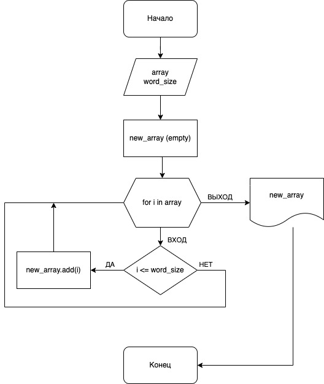

# Итоговая работа по вводному курсу 

## Задача
Написать программу, которая из имеющегося массива строк формирует массив из строк, длина которых меньше, либо равна 3 символам. Первоначальный массив можно ввести с клавиатуры, либо задать на старте выполнения алгоритма. При решении не рекомендуется пользоваться коллекциями, лучше обойтись исключительно массивами.

В решении, помимо кода, должны присутствовать:
- Блок-схема исполнительного алгоритма
- Описание работы алгоритма

## Описание работы.

Алгоритм реализован на [**Python**](./app) и [**C#**](./app_c%23). Особенности описаны отдельно к каждой реализации внутри соответствующих директорий.

## Как работает алгоритм отбора

Функция принимает на вход массив со строками и перебирает его элементы. При получение каждого элемента происходит сравнение его длины с заданным лимитом. Если строка укладывадывается в лимит, то она записывается в результирующий массив, который потом и возвращается пользователю.

Бллок-схема рабочего алгоритма выглядит так:

